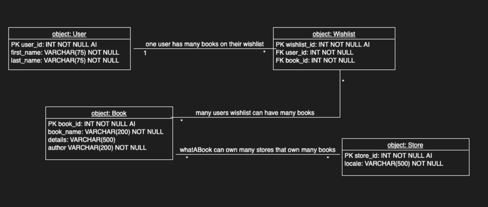

# csd-310

### Running whatabook.py
> with the latest change to `main`, you can run the main program wether you have mysql running on the host (you must run whatabook-initdb.d/ scripts) or in docker 
- the mysql database is made with docker, to stand up the database, you must have docker running, then from a teminal at the project root, run:

`
docker-compose -f whatabook-compose.ym up -d
`
- once your finished with the project, to clean up run:

`docker-compose -f whatabook-compose.yml down`
### module 10.2 ORD

    a User can have many Wishlist books.
    many Book(s) can be added to a User(s) Wishlist.
    many Book(s) can be added to one Wishlist.
    WhatABook has many Book(s).
    many Book(s) are owned by WhatABook.
    WhatABook can have many Location(s).

